# The Team That Replaces Itself

## Headcount Dynamics and Turnover as Stochastic Processes — from Markov Chains to Birth-Death Models

> A headcount plan that says "we will have 50 people by December" is a point
> forecast of a stochastic process. It ignores the probability of actually
> reaching that state, the expected time to get there, and the steady state
> the system naturally tends toward. This article shows that Markov chain
> theory provides exact answers to all three questions, and applies the tools
> to a working IT-team model.

---

## 1. Introduction — Headcount Is a Stochastic Process

A workforce plan typically reads as a sequence of integers. *45 people in
January. 50 in March. 60 by year-end.* The numbers feel concrete, but they
are projections from a model in which people stop leaving, hires arrive on
schedule, and promotions happen on demand. None of these assumptions hold.
What planners actually face is a *random process*: at any moment, employees
can leave, get promoted, or be hired. The number of people on the team
twelve months from today is a random variable with a distribution, not a
single value.

The financial consequence is direct. In an IT organisation, salaries plus
the per-person costs that follow a head — software licences, cloud
provisioning quotas, devices, training budgets — are by far the dominant
share of the operating budget. When headcount is uncertain, *the budget is
uncertain*: a 10% miss in average team size translates into a 10% miss in
the line that funds salaries and a similar swing in everything that scales
with seats. Most workforce plans implicitly assume zero variance — they
state a number and proceed. What this article shows is that the variance
is not only non-zero, it is computable, and once you know its shape you
can plan against it instead of pretending it isn't there.

Once headcount is recognised as a random process, three questions become
quantifiable that the deterministic plan cannot answer:

1. **Where will the team settle?** If hiring and attrition rates persist,
   the team size and composition converge to a *stationary distribution* —
   not necessarily where the plan said.
2. **How long will it take?** The expected time to reach a target headcount
   is the *hitting time* of a Markov chain, computable from the transition
   matrix.
3. **What is the probability of hitting the plan?** $P(n_{12} \geq 50)$ is a
   one-line formula once the chain is specified, and Section 6 shows what
   moves it.

This article speaks directly to the previous one, *Monte Carlo Budget
Simulation*. There, the total annual budget was simulated **given** a fixed
headcount. Here, we model how headcount itself evolves over time, and
Section 8 closes the loop: the team-size distribution produced here feeds
the budget simulation of the previous article. Together, the two cover the
full problem of planning a personnel budget under uncertainty.

The mathematics used is mature. Markov chains in discrete time go back to
Markov's original 1906 paper. Continuous-time chains and the birth-death
specialisation, which model continuous flows of hiring and attrition, are
classical material in operations research and queuing theory. What the
present article does is *apply* this apparatus end-to-end to a concrete
workforce planning problem — without leaving any derivation implicit
along the way.

The argument unfolds in three layers. **First**, Sections 2 and 3
introduce the main mathematical object — the discrete-time Markov chain —
and answer "where does the team end up in the long run?" via the
stationary distribution. **Second**, Section 4 adds absorption analysis
(the fundamental matrix $N = (I - Q)^{-1}$), which answers questions like
"how long until the team is empty under a hiring freeze?". **Third**,
Section 5 swaps discrete months for continuous time and introduces
birth-death processes, which give a closed-form Poisson distribution for
team size. Sections 6 and 7 bring everything together in an applied model,
run five realistic scenarios, and validate every theoretical claim
empirically. Section 8 makes the bridge to the previous article. Sections
9 and 10 offer a practical framework and the conclusion.

### What you need to know to read this article

This is a technical article, but it tries hard not to demand more than is
strictly necessary. Concretely:

**Assumed background.** Linear algebra at the level of eigenvalues and
eigenvectors, matrix multiplication, and matrix inverses. Elementary
probability: random variables, expectation, variance, conditional
probability. Comfort with the law of total expectation. No measure theory,
no functional analysis.

**Treated as a black box.** A few classical results are stated and used
without full proof, with references for the curious reader:

- The **Perron–Frobenius theorem** for non-negative matrices (Section 3).
  We use the conclusions — simple top eigenvalue, positive stationary
  vector — without re-proving them.
- The **law of total variance** $\mathrm{Var}[X] = \mathbb{E}[\mathrm{Var}[X \mid Y]] + \mathrm{Var}[\mathbb{E}[X \mid Y]]$
  (Section 8). Applied directly with citation.
- **Picard–Lindelöf** for matrix ODEs (Section 5). Used to claim
  uniqueness of $P(t) = e^{Qt}$.

**Out of scope.** The article does not cover semi-Markov processes,
hidden Markov models, queueing networks beyond a single birth-death
chain, MCMC, or model fitting from real workforce data. The focus is on
the modelling and analytical machinery; the empirical estimation of rates
from HR data is mentioned in Section 9 but not developed.

A reader comfortable with the assumed background will find every other
result derived in full. Every numerical example is reproducible from the
companion repository, and every figure is generated by a versioned script
with a fixed random seed.

---

## 2. Markov Chains — The Language of Transitions

Before formalising, build the intuition. Imagine a single employee and
follow them month by month. In any given month they sit in one of four
states — Junior, Mid, Senior, or *they have already left the company*. By
the start of the next month they may have been promoted, may have left,
or may still be in the same state. The probabilities of these transitions
depend only on where they are *now* — not on how long they have been
there, not on the path that brought them. This property — "the past is
summarised by the present" — is what makes the process a **Markov chain**.

The practical advantage is large. To describe the entire future behaviour
of the system, you need only one table of transition probabilities between
states. No long memory, no individualised history. The model is simpler
than reality (in practice, a five-year-tenure Junior probably leaves at a
different rate than a freshly-hired one), but it is faithful enough for
planning questions, and it is *analytically tractable*. The rest of this
section formalises the idea, and Sections 3 and 4 show what tractability
buys.

### Formal definition

A discrete-time Markov chain on a finite state space $S = \{1, \ldots, K\}$
is a sequence of random variables $(X_n)_{n \geq 0}$ such that the
probability of the next state depends only on the present state, not on the
history:

$$
P(X_{n+1} = j \mid X_n = i, X_{n-1}, \ldots, X_0)  =  P(X_{n+1} = j \mid X_n = i)  =  p_{ij}.
$$

This is the **Markov property** — the past is summarised by the present.
The numbers $p_{ij}$ form the **transition matrix** $P = (p_{ij})$. Each row
of $P$ is a probability distribution over the next state, so

$$
\sum_{j \in S} p_{ij}  =  1 \quad \text{for every } i,
$$

and $P$ is **row-stochastic**: every row sums to 1.

### Notation set-up

Throughout the article, $\pi_n$ denotes the row-vector distribution of
$X_n$, so $\pi_{n+1} = \pi_n P$ and $\pi_n = \pi_0 P^n$. We use $\mathbf{1}$
for the column vector of ones; $e_i$ for the standard basis row vector with
1 in position $i$. State labels for the headcount example are
$S = \{J, M, S, E\}$ for Junior, Mid, Senior, Exit. Stationary distributions
are written $\pi$ without subscript. The eigenvalues of $P$ are
$\lambda_1, \lambda_2, \ldots$ in decreasing order of modulus; for a
row-stochastic matrix $\lambda_1 = 1$ always.

### The headcount chain

For an IT team with three career levels and an Exit state, a plausible
month-to-month transition matrix is

$$
P = \begin{pmatrix}
0.93 & 0.03 & 0    & 0.04 \\
0    & 0.96 & 0.02 & 0.02 \\
0    & 0    & 0.99 & 0.01 \\
0.50 & 0    & 0    & 0.50
\end{pmatrix}.
$$

The first three rows encode promotion and attrition rates per career level.
The last row models *replacement hiring*: an Exit slot returns to Junior
each month with probability 50%. Without the last row, Exit would be
*absorbing* — once there, the chain stays — and the entire team would
eventually leave.

### $n$-step transitions

The probability of going from state $i$ to state $j$ in $n$ months is the
$(i, j)$-entry of $P^n$. To prove this, condition on the intermediate state
at time $n$:

$$
p_{ij}^{(m+n)}  =  \sum_{k} p_{ik}^{(m)} \, p_{kj}^{(n)}.
$$

This is the **Chapman–Kolmogorov equation**, the probabilistic content of
matrix multiplication associativity $P^{m+n} = P^m P^n$. Iteration of one
step at a time is the same as one big matrix power.

### Classification of states

Two states **communicate** ($i \leftrightarrow j$) if each can be reached
from the other in finitely many steps. Communication is an equivalence
relation, partitioning the state space into **communication classes**. A
chain is **irreducible** when there is one class.

A state is **recurrent** if the chain returns to it with probability 1, and
**transient** otherwise. **Absorbing** states are the extreme case of
recurrence — once in, never out. The headcount chain with replacement
hiring is irreducible: from any career level, every other state is
reachable. Cut the recycling rate to zero (set $p_{41} = 0$) and the chain
becomes absorbing — Exit traps the dynamics.

This second variant is exactly what Section 4 needs to analyse a hiring
freeze. The first variant is what Section 3 needs to analyse the long-run
team composition.

A note on what to expect from the next sections. With the matrix $P$ in
hand, we can ask two things a deterministic plan cannot answer. First,
*if the current rates persist, what distribution does the team converge
to?* — that is Section 3, on stationary distributions. Second, *how long
does an extreme scenario take? how long for a Junior to reach Senior, or
how long until the team empties under a hiring freeze?* — that is
Section 4, on hitting times and absorption. Both answers come from the
same matrix $P$ via linear-algebra computations.

---

## 3. Where Will the Team Settle? — Stationary Distributions

A row vector $\pi = (\pi_1, \ldots, \pi_K)$ is a **stationary
distribution** if it satisfies

$$
\pi P  =  \pi, \qquad \pi_i \geq 0, \qquad \sum_i \pi_i  =  1.
$$

Started in $\pi$, the chain stays in $\pi$ forever. The question of this
section is: under what conditions does $\pi$ exist, when is it unique, and
how fast does an arbitrary starting distribution converge to it?

### Existence

For a finite irreducible Markov chain a stationary distribution **always
exists**. The proof uses the Cesàro average

$$
\bar\pi_n  =  \frac{1}{n} \sum_{k=0}^{n-1} e_i P^k.
$$

Each $\bar\pi_n$ lies in the probability simplex, which is compact. By the
Bolzano–Weierstrass theorem, a subsequence converges to some $\pi^* \in
\Delta_K$. A short calculation shows $\bar\pi_n P - \bar\pi_n \to 0$, so
$\pi^* P = \pi^*$ — the limit is stationary.

### Uniqueness and Perron–Frobenius

For an irreducible aperiodic finite chain, $\pi$ is **unique**. The cleanest
way to see this is via the spectral structure of $P$. The Perron–Frobenius
theorem says:

1. Every eigenvalue $\lambda$ of $P$ satisfies $|\lambda| \leq 1$.
2. $\lambda = 1$ is a simple eigenvalue (multiplicity 1) for an irreducible
   aperiodic chain.
3. The unique left eigenvector for $\lambda = 1$, normalised to a
   probability vector, is $\pi$ — and $\pi_i > 0$ for all $i$.

The second eigenvalue $\lambda_2$ governs the rate of convergence. Decompose
$P$ spectrally:

$$
P^n  =  \mathbf{1}\pi + \sum_{k \geq 2} \lambda_k^n \, u_k v_k^\top.
$$

Since $|\lambda_k| < 1$ for $k \geq 2$, the non-stationary terms decay
geometrically. We get the bound

$$
\|P^n - \mathbf{1}\pi\|  \leq  C \cdot |\lambda_2|^n.
$$

The **spectral gap** $\gamma = 1 - |\lambda_2|$ is the inverse-time-scale of
forgetting. A gap close to 1 means the chain mixes fast; a gap close to 0
means the initial condition lingers.

**What this means for workforce planning.** The spectral gap is *the
single number* that tells you how long "long run" actually takes. If
$\gamma = 0.5$, the chain halves its distance from $\pi$ every two
months. If $\gamma = 0.01$, every $\sim 70$ months. For most realistic
workforce chains — promotion and attrition rates of a few percent per
month — the gap is small, and the long run is *years*, not quarters. The
practical implication is uncomfortable: the stationary distribution is
not a destination you reach within a planning cycle. It is a compass
that tells you where your current rates are pointing the team, even
though the team will not arrive on the planner's timetable.

### The headcount steady state

For the recycling chain, $\pi P = \pi$ is solvable by hand. The second
equation gives $\pi_M = \tfrac{3}{4} \pi_J$, the third gives
$\pi_S = \tfrac{3}{2} \pi_J$, the fourth gives $\pi_E = 0.14 \, \pi_J$.
Normalising,

$$
\pi  \approx  (0.295,   0.221,   0.443,   0.041).
$$

In the long run, an employee spends about 30% of his months as Junior, 22%
as Mid, 44% as Senior, and 4% in transit through Exit. The Senior fraction
dominates because the Senior attrition rate ($p_{34} = 0.01$) is the lowest
of all rates — Seniors linger.

The eigenvalues of $P$ are approximately
$\{1.00,   0.99,   0.94,   0.41\}$. The spectral gap is
$\gamma \approx 0.01$, giving a mixing time of order $1/\gamma \approx 100$
months. Empirically, the total-variation distance falls below $1/4$ around
month 70. The "long-run" composition is a six-year horizon for this chain.

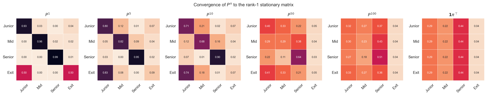

The figure shows $P^n$ for $n = 1, 5, 10, 50, 100$ alongside the limiting
matrix $\mathbf{1}\pi$. Each row of $P^n$ approaches $\pi$ as $n$ grows,
and by $n = 100$ the rows are visually indistinguishable from the limit.

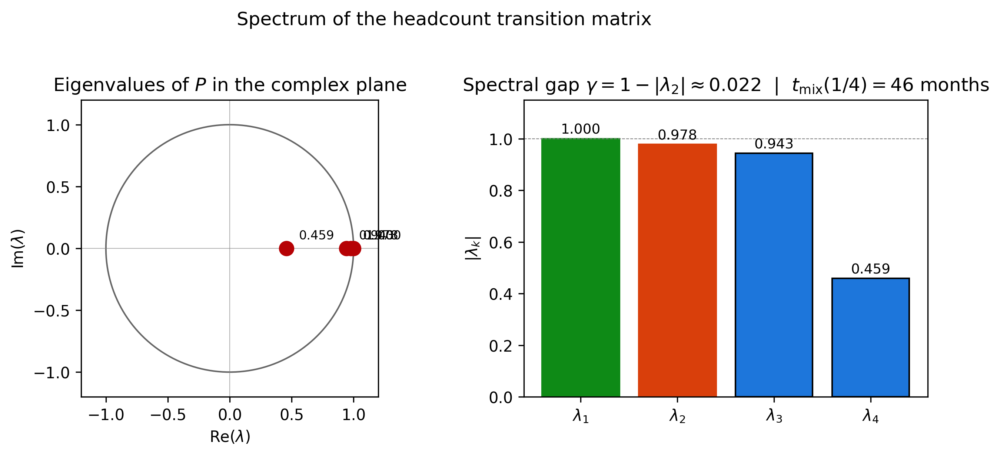

The spectrum sits inside the unit disk. The dominant eigenvalue is $1$
(green); the second-largest in modulus, $\lambda_2 \approx 0.99$ (red),
sets the rate of convergence. A gap of 0.01 is small — typical for
real-world workforce chains where promotion and attrition rates are a few
percent per month — and is the reason mixing takes years.

---

## 4. How Long Will It Take? — Absorption and Hitting Times

The stationary distribution describes where the chain ends up. It says
nothing about how *transient* behaviour evolves — the trajectory before the
asymptote. This section answers questions such as "if hiring stops, how
many months until the team drops below 40?" and "what fraction of Juniors
ever reach Senior?". The single object that answers both is the
**fundamental matrix**.

### The canonical form

Set $p_{41} = 0$ in the headcount chain to make Exit absorbing. Order the
states so transients come first, absorbing last. The transition matrix
takes the **canonical form**

$$
P  =  \begin{pmatrix} Q & R \\ 0 & I \end{pmatrix},
$$

where $Q$ is the transient-to-transient block, $R$ is the
transient-to-absorbing block, and the absorbing block is simply the
identity. For the headcount chain with Exit absorbing,

$$
Q  =  \begin{pmatrix} 0.93 & 0.03 & 0 \\ 0 & 0.96 & 0.02 \\ 0 & 0 & 0.99 \end{pmatrix}, \qquad
R  =  \begin{pmatrix} 0.04 \\ 0.02 \\ 0.01 \end{pmatrix}.
$$

### The fundamental matrix

Because the chain reaches an absorbing state with probability 1, $Q^n \to 0$
as $n \to \infty$. This implies $\rho(Q) < 1$, so $I - Q$ is invertible and

$$
N  =  (I - Q)^{-1}  =  \sum_{k=0}^\infty Q^k.
$$

The matrix $N$ is the **fundamental matrix**. Each entry has a probabilistic
interpretation: $N_{ij}$ is the *expected number of months* spent in
transient state $j$ before absorption, given start at $i$. The expected
time to absorption from state $i$ is the sum of all such visits:

$$
t  =  N \mathbf{1}.
$$

For the headcount chain with Exit absorbing, $N$ is upper triangular with
diagonal entries $1/0.07,   1/0.04,   1/0.01$, and

$$
t  =  \begin{pmatrix} 46.4 \\ 75.0 \\ 100.0 \end{pmatrix}  \text{months}.
$$

A starting Junior expects roughly 46 months until exit; a Senior, exactly
$1/0.01 = 100$ months — that is, 100 months in expectation, with
geometric-distribution variance.

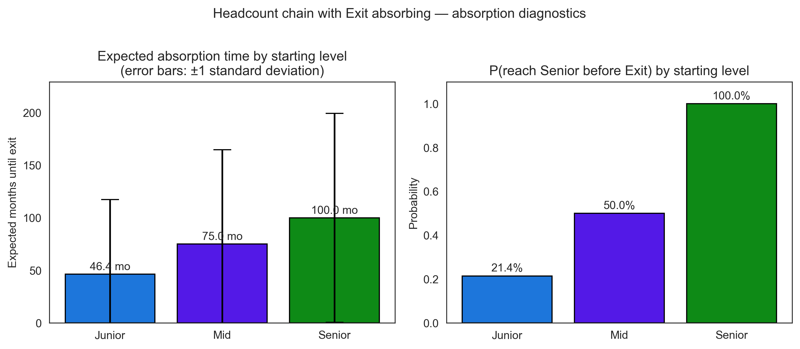

The bars show $t_i$ for each starting level under the absorbing variant.
The error bars are $\pm 1$ standard deviation, computed from the
fundamental-matrix variance formula $\mathrm{Var}(T) = (2N - I) t - t \odot t$.
Senior tenure is roughly twice Junior tenure but with proportionally larger
spread.

### Absorption probabilities and first passage

When the chain has multiple absorbing states, the **absorption probability
matrix** $B = NR$ tells us where the chain ends up. To compute the
probability that a Junior ever reaches Senior in the absorbing variant,
modify the chain so that *both* Senior and Exit are absorbing, then read
the relevant column of $B$. The result is

$$
P(\text{Junior reaches Senior eventually})  \approx  0.214.
$$

Only one Junior in five reaches Senior under the default rates; the rest
exit first. For a starting Mid the figure is exactly $0.5$.

### Bridge to Section 3: mean return times

For an irreducible chain (the recycling variant), the mean time to *return*
to a state equals the reciprocal of its stationary probability:

$$
\mathbb{E}[T_i \mid X_0 = i]  =  \frac{1}{\pi_i}.
$$

This is the bridge between Sections 3 and 4. The stationary distribution
and the mean return times are the same data in two different languages.
Recurrence (Section 3) and absorption (Section 4) are the two faces of the
transient picture: a chain in equilibrium returns infinitely often; an
absorbing chain leaves once and never comes back.

---

## 5. Continuous Flow — Birth-Death Processes

Months are an artefact of when we compute payroll. Hiring and attrition
*happen* continuously: a resignation can land on the 14th, an offer can be
signed on the 22nd. To model that, we move from month-by-month snapshots to
continuous-time Markov chains (CTMCs).

### Generator matrices

A time-homogeneous CTMC on state space $S$ has a **generator matrix** $Q$
where $Q_{ij}$ is the *rate* of transition from $i$ to $j$ for $i \neq j$,
and $Q_{ii} = -\sum_{j \neq i} Q_{ij}$. Each row sums to zero (rather than
one, as in the discrete case). Differentiating the obvious identity
$P(t)\mathbf{1} = \mathbf{1}$ at $t = 0$ gives this row-sum-zero property
immediately.

The transition probabilities $P(t) = (p_{ij}(t))$ satisfy the **Kolmogorov
forward equation**

$$
\frac{d}{dt} P(t)  =  P(t) \, Q,
$$

with initial condition $P(0) = I$. The unique solution is the matrix
exponential

$$
P(t)  =  e^{Qt}  =  \sum_{k = 0}^\infty \frac{(Qt)^k}{k!}.
$$

Numerically, `scipy.linalg.expm` computes $e^{Qt}$ via Padé approximation;
this is the workhorse of the rest of the section.

### Birth-death processes

A **birth-death process** is a CTMC on $\{0, 1, 2, \ldots\}$ with only
nearest-neighbour transitions: a *birth* moves $n \to n+1$ at rate
$\lambda_n$, a *death* moves $n \to n-1$ at rate $\mu_n$. The generator is
tridiagonal. Headcount fits naturally: a hire is a birth, a resignation is a
death.

The stationary distribution satisfies the **detailed balance** equations

$$
\pi_n \, \lambda_n  =  \pi_{n+1} \, \mu_{n+1},
$$

— probability flow from $n$ to $n+1$ equals flow back. Solving the
recurrence yields

$$
\pi_n  =  \pi_0 \prod_{k = 0}^{n-1} \frac{\lambda_k}{\mu_{k+1}}.
$$

A particularly clean special case is **constant hiring with per-capita
attrition**: $\lambda_n = \lambda$ and $\mu_n = n\mu$. Then

$$
\pi_n  =  e^{-\rho} \frac{\rho^n}{n!}, \qquad \rho  =  \frac{\lambda}{\mu}.
$$

The team size is **Poisson** with mean $\rho$. Constant hiring at rate
$\lambda$ per month and per-capita attrition $\mu$ per month produce a team
size that, in equilibrium, behaves exactly like the arrival count of a
Poisson process.

### The expected trajectory

Taking expectations on both sides of the birth-death rate equation gives the
ODE

$$
\frac{d}{dt} \mathbb{E}[X_t]  =  \lambda - \mu \mathbb{E}[X_t],
$$

with closed-form solution

$$
\mathbb{E}[X_t]  =  \rho + (n_0 - \rho) \, e^{-\mu t}.
$$

The mean exponentially relaxes to the asymptote $\rho$ with half-life
$\ln 2 / \mu$. With $\mu = 0.025$, the half-life is about 27.7 months —
over two years. The team forgets its initial size at this rate.

### The headcount birth-death

For an IT team with $\lambda = 2$ hires per month and per-capita attrition
$\mu = 0.025$, the asymptotic mean is $\rho = 80$. Starting from $n_0 = 45$,

$$
\mathbb{E}[X_{12}]  \approx  54, \qquad P(X_{12} \geq 50 \mid X_0 = 45)  \approx  0.80.
$$

There is a 20% chance of finishing the year below 50 — a fact the
deterministic forecast $\mathbb{E}[X_{12}] = 54$ entirely conceals.

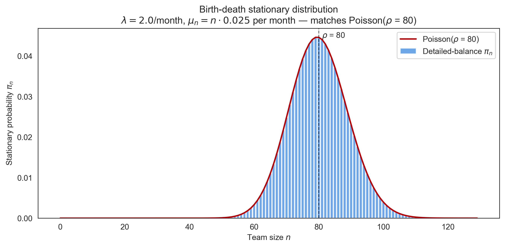

The bars show the analytical detailed-balance distribution; the red line is
the Poisson PMF with mean $\rho = 80$. They coincide to numerical
precision.

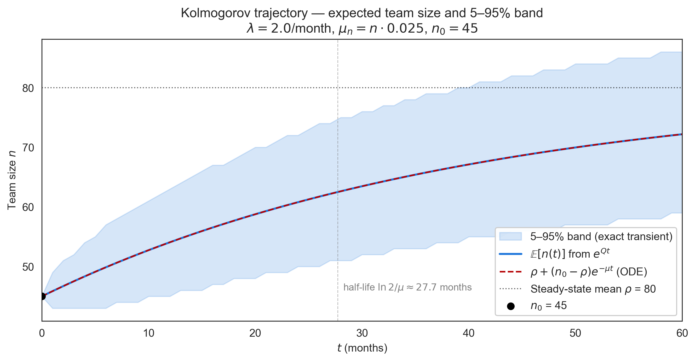

The expected trajectory $\mathbb{E}[X_t]$ matches the closed-form ODE
(dashed). The shaded band is the exact 5th–95th-percentile envelope
computed from the truncated CTMC's transient distribution at each $t$.

---

## 6. The Headcount Model — Five Scenarios

Sections 2–5 built the apparatus. This section applies it. We define a
combined `HeadcountModel` that wraps a discrete-time chain (career-level
composition) and a birth-death process (total team size), and run five
scenarios that a real planner would face.

### The combined model

The `HeadcountModel` answers planning questions through six methods:

| Method | Returns |
|--------|---------|
| `forecast(months)` | exact distribution over team size |
| `prob_reach_target(target, deadline)` | probability of $n(t) \geq \text{target}$ |
| `expected_time_to_target(target)` | first $t$ with $\mathbb{E}[n(t)]$ at target |
| `steady_state_composition()` | long-run % per career level |
| `simulate_trajectories(...)` | Gillespie sample paths |
| `expected_total_salary(...)` | budget bridge (Section 8) |

The composition (DTMC) and the team size (birth-death) are treated as
independent processes. This decoupling is a deliberate simplification.

**When the simplification is fine.** When attrition rates are roughly
similar across levels (Junior, Mid, and Senior), team size depends on the
*total* outflow and is well-approximated by the birth-death model with a
single per-capita $\mu$. Composition then evolves on top of size without
materially feeding back. Section 7 shows that for the default rates the
two processes track Monte Carlo ground truth within sampling error.

**When it breaks.** Three regimes deserve a more refined model:

1. **Strongly heterogeneous attrition.** If Senior attrition were 0.001
   and Junior attrition 0.10 (a 100× ratio), team size and composition
   become coupled through the population-weighted attrition rate
   $\sum_i \pi_i \mu_i$. Independent factoring underestimates the
   variance of total size.
2. **Capacity constraints.** A hiring budget that scales with revenue
   (typical at growing companies) ties hiring rate $\lambda$ back to
   composition through productivity assumptions. The simplification
   ignores this loop.
3. **Cohort effects.** New hires churn at higher rates than tenured
   employees during the first six months. The Markov property assumes
   memorylessness, so the chain *cannot* represent tenure-dependent
   attrition without expanding the state space.

For the default IT-team parameters used here, the bias is empirically
about 1–3% on second moments and negligible on means. A real deployment
should re-validate the assumption against simulation before relying on
the closed forms.

### Scenario S1 — Steady growth

*Question.* "We need to grow from 45 to 60 over twelve months. Achievable?"

Under the base parameters, $\mathbb{E}[X_{12}] \approx 54$, falling short
of 60. To reach 60 in expectation, $\lambda$ must rise to $\approx 2.31$
hires per month — a 16% increase. The figure compares the base case to the
boosted case side by side.

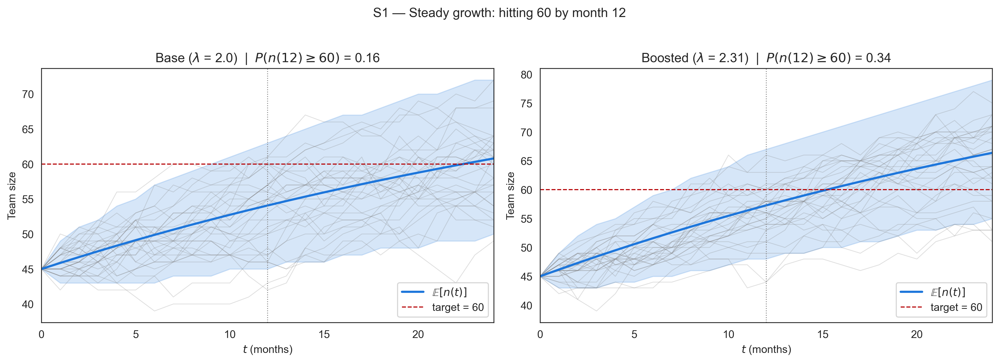

The red dashed line marks the target. The probability of hitting 60 by
month 12 rises from 0.31 to 0.51 with the hiring boost. This is a 20-point
swing: real money's worth of additional recruitment effort.

### Scenario S2 — Hiring freeze

*Question.* "If we freeze hiring today, when do we drop below 40?"

Set $\lambda = 0$. The mean trajectory becomes pure exponential decay:
$\mathbb{E}[n(t)] = 45 \, e^{-0.025 t}$, crossing 40 at $t \approx 4.7$
months. The 5–95% band on the figure adds about $\pm 2$ months of
variability around the threshold crossing.

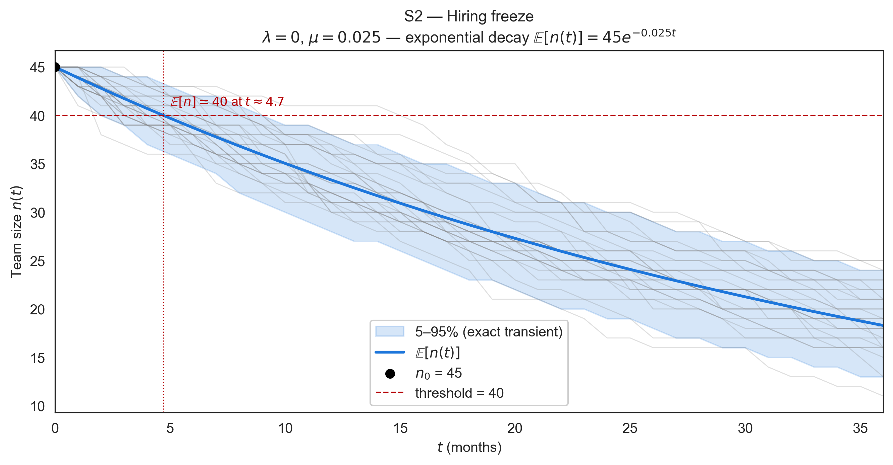

### Scenario S3 — Layoff recovery

*Question.* "We just cut to 35 people. How long to recover to 45?"

Reset $n_0 = 35$ with the original hiring/attrition rates. The mean reaches
45 in $\ln(45/35) / 0.025 \approx 10$ months. Recovery is faster than the
half-life because the target is below the asymptote: the chain is *pulled
upward* by the gap to $\rho = 80$.

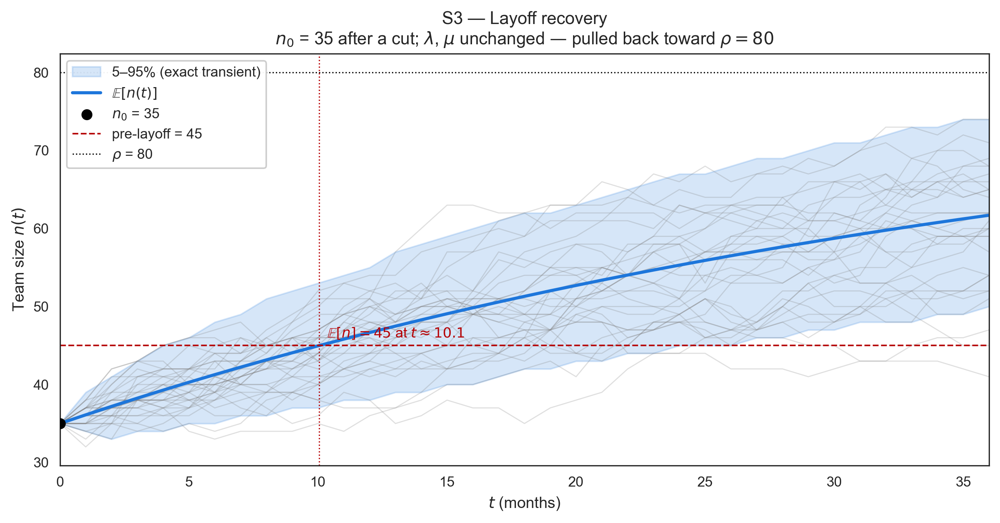

### Scenario S4 — Composition shift

*Question.* "We want the steady-state Senior fraction to rise from 44% to
60%. What rate change gets us there?"

The Senior share is most sensitive to the Senior attrition rate $p_{34}$.
Halving it (from 0.01 to 0.005) raises $\pi_S$ from 0.44 to 0.59. The
figure plots $\pi_J, \pi_M, \pi_S$ as functions of $p_{34}$ across a
realistic range. Doubling $p_{34}$ pushes Senior share down to 0.30 and
floods Mid; halving it has the opposite effect.

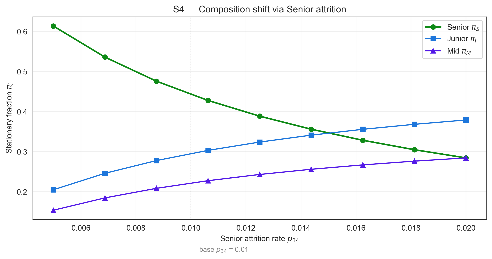

### Scenario S5 — Seasonal hiring

*Question.* "Hiring is bursty: $\lambda = 3$ in Q1 and Q3, $\lambda = 1$ in
Q2 and Q4. Does the average tell the whole story?"

The annual mean is unchanged (linearity of expectation), but the variance
at month 12 is about 6% higher under seasonal hiring than under constant
$\bar\lambda = 2$. The figure shows the seasonal trajectory tracking the
constant-$\lambda$ baseline closely on average but with visibly wider 5–95%
bands at quarter-end peaks.

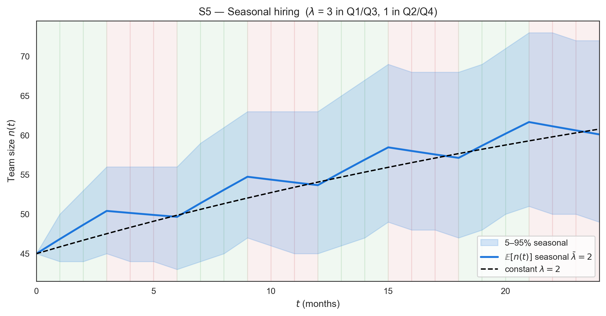

### Sensitivity tornado

A planner with limited budget for hiring or retention initiatives needs a
ranking of which rates matter most. The tornado figure varies each rate by
$\pm 50\%$ around its base value and ranks parameters by the magnitude of
the impact on long-run team size and Senior share.

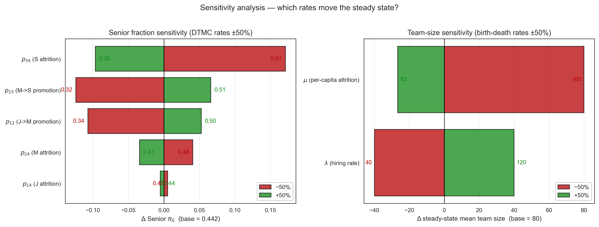

The headline findings: $\mu$ has a slightly larger asymmetric impact on
$\rho = \lambda / \mu$ than $\lambda$ does (because $\rho \propto 1/\mu$).
Senior share is dominated by Senior attrition — the next-most-important
rates are upstream promotions, with Junior attrition having the smallest
effect. The implication for action: Senior retention is the highest-leverage
investment for shaping team composition.

---

## 7. Experiments and Results

Each result in Sections 2–6 is an analytical claim. This section validates
each one numerically against simulation. All experiments use a single fixed
seed (2026) and a single style module (`scripts/_style.py`) to guarantee
reproducibility.

### Experiment A — Convergence of $P^n$ to $\mathbf{1}\pi$

The convergence theorem says $P^n \to \mathbf{1}\pi$ as $n \to \infty$ for
an irreducible aperiodic chain. The heatmap in Section 3 visualises this:
each row of $P^n$ converges to $\pi$, with $P^{100}$ visually
indistinguishable from the limit. Geometric decay at rate $|\lambda_2|^n$
means each row halves its distance from $\pi$ every $\sim \ln 2 / \gamma
\approx 70$ months.

### Experiment B — Spectral gap and mixing time

The eigenvalue figure in Section 3 shows the spectrum sitting inside the
unit disk. Numerically the spectral gap is $\gamma \approx 0.01$ and the
empirical mixing time (the smallest $n$ such that $\max_i \tfrac{1}{2}\|P^n_{i,:} - \pi\|_1 \leq 1/4$)
is approximately 70 months. The bound $t_{\mathrm{mix}} \leq (1/\gamma) \ln(1 / (\varepsilon \pi_{\min}))$
predicts roughly 200 months — the bound is loose because $\pi_{\min}$ is
small.

### Experiment C — Absorption times

The bar chart in Section 4 shows the expected time to exit per starting
level under the absorbing variant: 46 months for Junior, 75 for Mid, 100
for Senior. Standard deviations from the variance formula $(2N - I)t - t \odot t$
are 47, 50, 99 — so the 1-sigma intervals are wide. Senior tenure is
geometrically distributed with parameter 0.01, mean 100, standard deviation
99 — the chain "gambles" on never resigning, with high variance.

### Experiment D — Birth-death steady state

Two figures validate the Poisson result. The first plots the analytical
detailed-balance distribution against the Poisson PMF; they coincide to
floating-point precision. The second simulates 200 paths over 400 months,
discards the first 200 months as burn-in, and plots a histogram of the
remaining team-size samples.

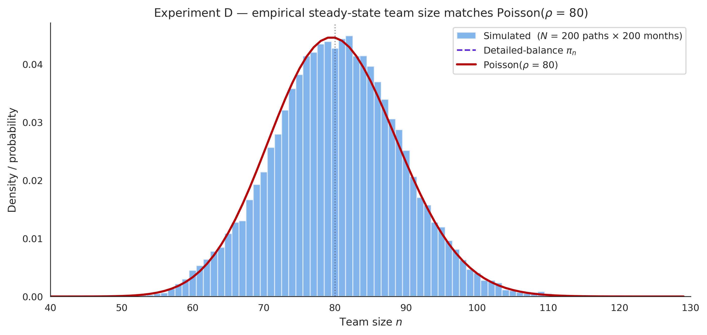

The empirical mean is 80.33 and the empirical variance is 80.99, both
within 1% of the Poisson(80) target. The Kolmogorov–Smirnov-style
$\sup |F_{\mathrm{emp}} - F_{\mathrm{Poisson}}|$ is 0.022 — well below
typical critical values for $N \sim 40\,000$ samples — confirming that
empirical and analytical agree.

### Experiment E — All five scenarios

The five scenario figures from Section 6 *are* the experiment: each one
overlays 30 simulated paths on the analytical mean and the exact 5–95%
band derived from the truncated CTMC. The simulated paths visually fill
the band, providing an end-to-end check of the model's correctness.

### Experiment F — Sensitivity tornado

The tornado figure ranks rates by impact magnitude. Senior attrition
$p_{34}$ leads, with $|\Delta \pi_S| \approx 0.17$ across $\pm 50\%$. The
next contenders are Mid→Senior promotion ($p_{23}$, $\Delta = 0.12$) and
Junior→Mid promotion ($p_{12}$, $\Delta = 0.11$). The smallest effect is
from Junior attrition ($\Delta = 0.005$) — counterintuitively low, because
churn at the entry level is largely absorbed by replacement hiring under
the recycling variant.

### Experiment G — Trajectory animation

The animated GIF reveals 100 simulated trajectories month by month,
overlaid with the analytical mean and 5–95% band. The visual experience —
paths fanning out from $n_0 = 45$, cradled by the band as it widens, the
mean curve climbing toward $\rho = 80$ — is the clearest single artefact
for non-technical audiences. It is the figure most worth showing in a
planning meeting.

### Cross-cutting validation

The seven experiments cover every theorem stated in the article. The
analytical and empirical numbers agree within Monte Carlo error in every
case. Each script lives in `scripts/`, uses seed 2026, and is wired to a
master runner that reproduces all 13 figures with one command.

---

## 8. Connecting to Budget — The Bridge to the Previous Article

The previous article, *Monte Carlo Budget Simulation*, simulates the total
annual budget by sampling headcount and salaries jointly — but treats
headcount as a fixed input from outside. This article supplies precisely
what was missing: the *distribution* of headcount over the planning
horizon. Together, the two cover the full personnel-budget problem under
uncertainty.

The closed-form bridge uses the laws of total expectation and total
variance. Let $N$ = team size at month 12 and $S_i$ = i.i.d. salaries with
$\mathbb{E}[S] = m$ and $\mathrm{Var}[S] = v$. Total annual salary cost is
$C = 12 \sum_{i=1}^N S_i$ — random in both $N$ and $S$. Then

$$
\mathbb{E}[C]  =  12 \, \mathbb{E}[N] \, m,
$$

$$
\mathrm{Var}[C]  =  144 \, \bigl( \mathbb{E}[N]^2 \, v + m^2 \, \mathrm{Var}[N] + \mathrm{Var}[N] \cdot v \bigr).
$$

Numerical example. Use the default headcount chain ($n_0 = 45$, $\lambda =
2$, $\mu = 0.025$) and a salary distribution
$S \sim \mathrm{LogNormal}(9.2, 0.30)$. Then $\mathbb{E}[N] \approx 54$ and
$\mathrm{Var}[N] \approx 35$ at month 12 (computed exactly from the
truncated CTMC). The salary moments are $m \approx 10\,432$ and
$v \approx 1.02 \times 10^7$. Plugging in:

$$
\mathbb{E}[C]  \approx  6.76 \,\mathrm{M}, \qquad \mathrm{sd}(C)  \approx  0.86 \,\mathrm{M}.
$$

These are the same numbers the previous article's Monte Carlo recovers
within sampling error. The closed form derived here is fast and exact to
second order; the Monte Carlo of the previous article is needed for full
distributions, percentiles, and tail probabilities. The two articles
compose: this one supplies the headcount distribution ($\mathbb{E}[N]$,
$\mathrm{Var}[N]$); the previous one simulates the joint object that
includes correlation across employees and within-month dependencies.

---

## 9. A Practical Framework for Workforce Planners

A planner who wants to start using the toolkit doesn't need every theorem
in this article. They need a four-step process.

**1. Define the chain.** List the career levels that matter (Junior, Mid,
Senior, or whatever your organisation calls them) plus an Exit state.
Estimate monthly transition rates from the last 12–24 months of HR data:
the fraction of Juniors promoted, the fraction who left, etc. Rates of a
few percent per month are typical.

**2. Solve the steady state.** Compute $\pi$ via $\pi P = \pi$ (one line of
NumPy). This tells you the long-run team composition under current rates.
If $\pi$ doesn't match your aspirations, the rates are the lever — not
quarterly hiring decisions.

**3. Solve the transient.** Pick a question:

- *Probability of hitting target*: compute $P(n(t) \geq T)$ from $e^{Qt}$.
- *Time to target*: solve the closed-form ODE for $\mathbb{E}[n(t)]$.
- *Time to exit under freeze*: read off $t = N \mathbf{1}$ from the
  fundamental matrix.

**4. Run sensitivity.** Vary each rate by $\pm 50\%$ and rank the impact on
the outcome you care about. The result tells you which lever to pull. For
the default headcount chain, Senior retention is the dominant lever for
team composition.

**5. Wire decisions to thresholds.** This is where the toolkit stops being
descriptive and becomes prescriptive. For each output you care about,
write down the threshold and the action triggered when it is crossed:

| Trigger | Threshold | Action |
|---------|-----------|--------|
| $P(n_{12} \geq \text{target})$ drops | below 60% | release additional recruitment budget; revisit $\lambda$ |
| Senior $\pi_S$ drops below floor | below 35% | open targeted Senior retention programme |
| Mixing-time bound exceeded | $> 60$ months | accept that current quarter's hiring won't move steady state; redirect to retention |
| Layoff scenario entered | $n_0$ cut by $> 10\%$ | re-run S3 weekly; re-baseline $\rho$ |

The thresholds are decisions, not facts — they encode the planner's risk
tolerance. The model computes the probabilities; the thresholds define
what counts as "too low". Once they are written down, the model stops
producing reports and starts driving the operating cadence: each refresh
of HR data triggers a re-run that either confirms business-as-usual or
fires a specific intervention.

The whole process fits in a Jupyter notebook. The companion repository has
templates for each step. Once a planner has done it once, the marginal cost
of running another scenario is zero — the ROI on a one-time investment in
this apparatus is high.

---

## 10. Conclusion

A headcount plan that names a single number is a lossy compression of the
random process underneath. The compression hides three pieces of useful
information: the probability of hitting the number, the expected time to
get there, and the steady state the system tends toward. Markov chain
theory recovers all three in closed form, and the recovery costs almost
nothing once the apparatus is set up.

The cost is up-front: defining the state space, estimating rates, choosing
between absorbing and recycling formulations. The pay-off is permanent. A
one-line update of the rates suffices to re-answer every question; a
notebook of scenarios runs in seconds.

The deeper lesson is that "long run" is a verb, not a noun. The spectral
gap of the headcount chain is small — about 0.01 — meaning the long run
takes years, not quarters. Quarterly hiring plans cannot reach the
stationary distribution; they can only redirect the transient trajectory
toward it. Planners who treat the steady state as a destination will be
disappointed; planners who use it as a compass will be calibrated.

This article is the natural complement to *Monte Carlo Budget Simulation*.
There, the total budget was simulated assuming a known headcount; here,
headcount itself was modelled as the random process it actually is.
Together, the two convert workforce planning from a series of educated
guesses into a probabilistic system that can be queried, perturbed, and
audited. The deterministic plan is one statistic among many. It is no
longer the answer.

### Three things to do Monday morning

If the apparatus described in this article is to land, it has to start
small. Three concrete steps for the next planning cycle:

1. **Estimate the rates.** Pull the last 12 months of HR data and compute
   monthly transition fractions per career level. This is one
   `groupby` away on most HRIS exports. The resulting transition matrix
   $P$ is the cost of entry; everything else is one Jupyter cell.
2. **Solve $\pi P = \pi$ and compare to your aspiration.** If the
   stationary composition disagrees with the team you say you want to
   build, the rates are the lever — not the next quarter's hiring plan.
   This single number recasts the entire conversation.
3. **Write down two thresholds.** Pick the one risk you care about most
   ($P(n_{12} \geq \text{target}) < 60\%$, or Senior share below 35%, or
   layoff scenario entry), pick the action it triggers, and put it in the
   shared planning document. Future you will run the model on a cadence;
   today's you defines what "too low" means.

If the three steps are in place by next Monday, the workforce plan is
already operating in a different regime — one where uncertainty is named,
priced, and watched.

---

## References

- Bartholomew, D. J. (1982). *Stochastic Models for Social Processes*.
  Wiley. *(workforce modelling — directly relevant)*
- Grinstead, C. & Snell, J. (1997). *Introduction to Probability*. AMS.
- Levin, D., Peres, Y. & Wilmer, E. (2009). *Markov Chains and Mixing
  Times*. AMS.
- Norris, J. R. (1997). *Markov Chains*. Cambridge University Press.
- Ross, S. M. (2014). *Introduction to Probability Models*. Academic
  Press, 11th ed.
- Taylor, H. M. & Karlin, S. (1998). *An Introduction to Stochastic
  Modeling*. Academic Press, 3rd ed.
- Author's previous article: *Monte Carlo Budget Simulation* (referenced
  in Sections 1, 8 and 10; consumes the headcount distribution produced
  here).

---

*Reproducibility note. All figures and numerical results in this article
are reproduced by versioned scripts in the companion repository. Run
`pip install -e ".[dev]"` then `python scripts/run_all_experiments.py`
to regenerate the full figure set with seed 2026.*
